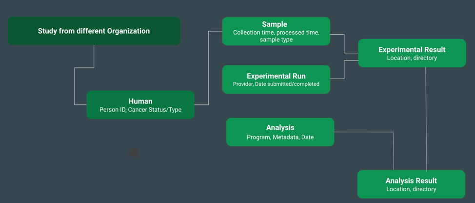
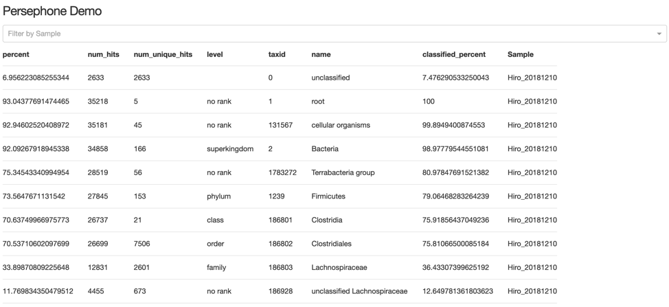
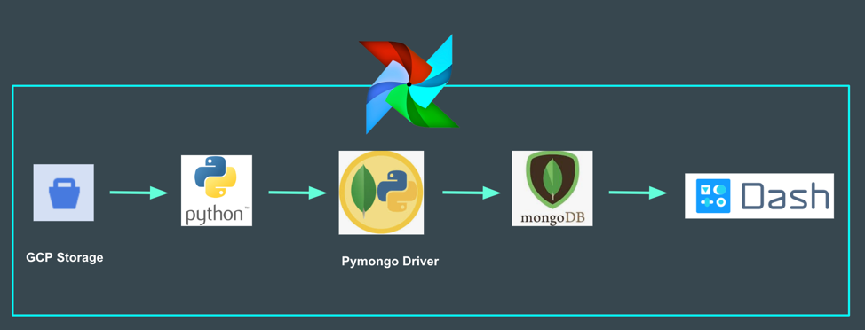

### Table of Contents

1. [Introduction](https://github.com/mzcolor001/Insight-DE-Project-Boston-2019/tree/branch-1#introduction)
2. [Components](https://github.com/mzcolor001/Insight-DE-Project-Boston-2019/tree/branch-1#components)
3. [Data Pipeline](https://github.com/mzcolor001/Insight-DE-Project-Boston-2019/tree/branch-1#data-pipeline)
4. [Performance](https://github.com/mzcolor001/Insight-DE-Project-Boston-2019/tree/branch-1#performance)

### Introduction
__________________________________________________________________________________________________

Biotrain is a querying and aggregating platform for showing the medication impacts on patients with cancers. It is a data pipeline that enables researchers and doctors to trace the medications being taken by the patients, and obtain the experiments being run on them and its corresponding sequence data. The informatoin gained from the sequence data are displayed in a dashboard so that it could help researchers and doctors to decide further treatment for the patients and what kind of organisms is crucial for curing certain cancers and also for preventing cancers.

Biotrain uses data from Persephone Biome to serve the application. The data is stored in [GCP](https://cloud.google.com/) buckets, and [Python script](https://github.com/mzcolor001/Insight-DE-Project-Boston-2019/tree/branch-1/Code) to clean and extract the patient information, and generate the JSON files for differnt experiments run on the patients. [MongoDB](https://www.mongodb.com/) is used for aggregating the patient info., experimental runs and analysis results with patients. [Pymongo](https://api.mongodb.com/python/current/) is used as a MongoDB driver to talk to the database. [Dash](https://dash.plot.ly/) is used to build the front-end so the user could query their desired information. [Apache Airflow](www.airflow.org) is used to automate the above pipeline and send the monitoring information to the user.

### Components
__________________________________________________________________________________________________
  * #### Data Production

  - The data resides in the GCP is read into the local server through [file](https://github.com/mzcolor001/Insight-DE-Project-Boston-2019/blob/branch-1/tools/GCP/GCP.sh) and the data size is about 30Gb, the file hierachy is organized below:
 

```
├── Persephone
          ├── metadata_sanguine_Cancer.xlsx
          ├── metadata_sanguine_Controls.xlsx
          ├── metadata_sanguine_Cancer-human.xlsx
          ├── metadata_sanguine_Controls-human.xlsx
          ├── MiniSeq Submission Sheet.xlsx
          ├── wgs11N
                ├── analysis
                │      └── centrifuge
                │ 		      ├── 05_S1
                │           │     └── kreport.tsv.gz
                │           │     └── report.tsv.gz
                │           │     └── hits.tsv.gz
                │           │...
                │           │...
                │           │...
                │           ├── 64_S45
                │           │     └── kreport.tsv.gz
                │           │     └── report.tsv.gz
                │           │     └── hits.tsv.gz
                ├── trimmed
                        └── 25_S6_R2_001_val_2.fq.gz
                        └── ...
                        └── ...
                        └── ...
                        └── 17_S3_R1_001.fastq.gz_trimming_report.txt
```
  * #### Data Storage
  - *Schema*

 Given the possibility of the frequent schema changing, MongoDB is chosen to resolve this problem. Also given the complexity of the data format, one-to-many relationships and the size of each record (some of the files > 2GB), the model tree is adopted insted of the embedded documents.
 Please refer the schema below.





  - *Aggregation*

 There are five collections which contain the patient info., sample info., experimental run, experimental result and analysis result in the database. Connecting all five collections was tried, and it didn't work with this case. [MongoDB doesn't provide multiple collections' join](https://docs.mongodb.com/manual/reference/operator/aggregation/lookup/#pipe._S_lookup). This aggregation is done through this [script](https://github.com/mzcolor001/Insight-DE-Project-Boston-2019/blob/branch-1/src/MongoDBinsert.py).

  - #### Front-end

 The analysis result is read through MongoDB and displayed with Dash. The user is able to search the desired patient from the dropdown and query and display the patients' information.




  - #### Data Monitoring/Scheduling
 In order to automate the whole process mentioned above, [Apache Airflow](www.airflow.org) is used to schedule the data distribution from GCP to local sever, manage the interface to database, and also trigger the front-end. The message will be sent out as email format when the sheduling fails.

### Data Pipeline
__________________________________________________________________________________________________



### Performance
__________________________________________________________________________________________________
The timing of reading the data from GCP is about ~20mins, and the timing of extracting, transforing and displaying on a dashboard is about ~17s.


__________________________________________________________________________________________________

### Packages
1. [Dash](https://dash.plot.ly/)
2. [Pymongo](https://api.mongodb.com/python/current/)
